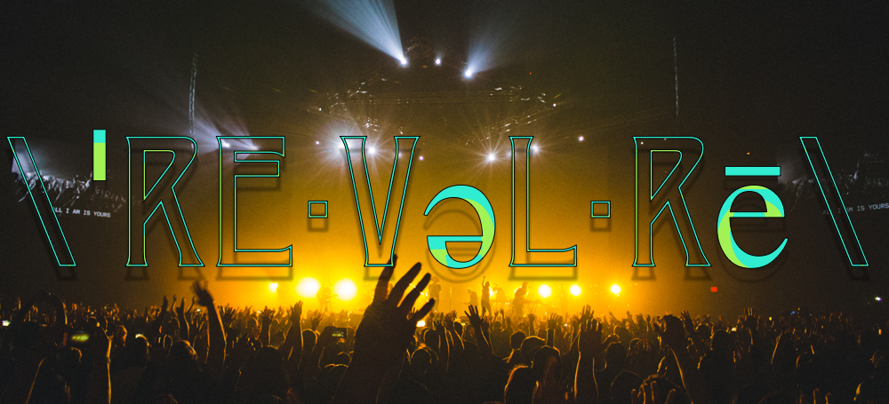
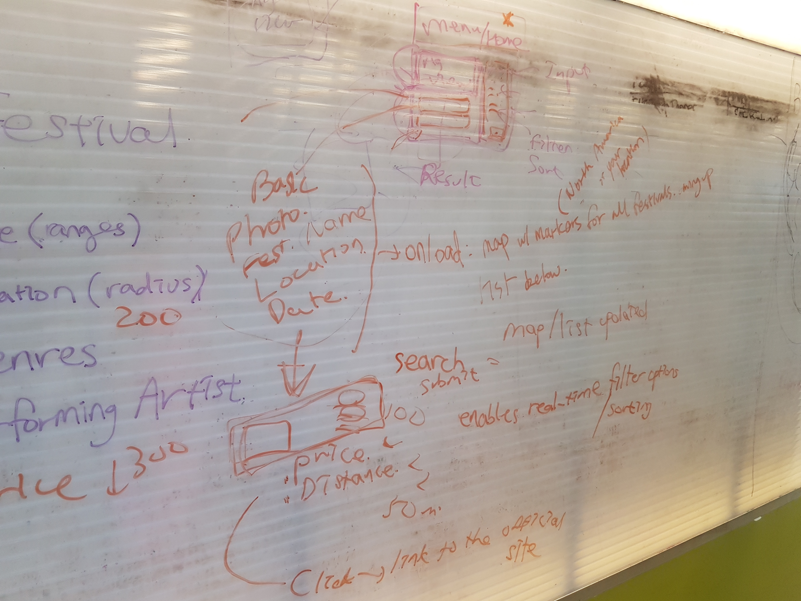
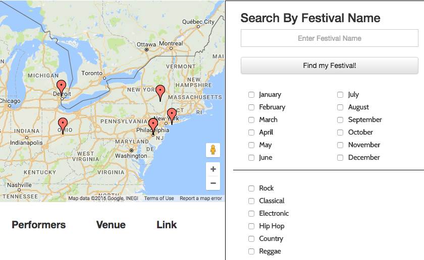
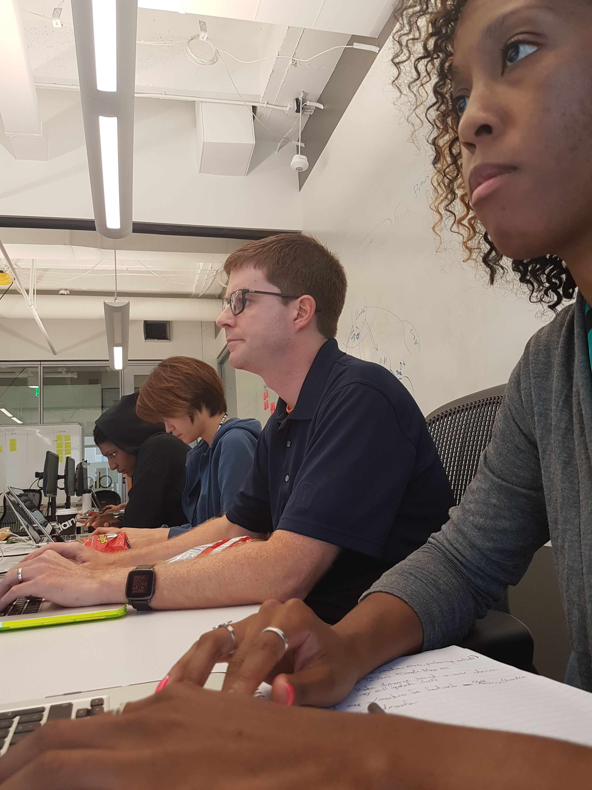

#Hacker-Snackers Front-End-Project



###A dynamic app that allows users to locate music festivals around the nation. This is done by utilizing the search options to narrow down the users unique preferences and display the locations on an interactive map. Once the search executes, the user will be presented with festival options and corresponding information.

Visit here: [Revelry.com](http://shirletterly.com/hacker-snackers/#/)

##Built with:
	- Html
	- CSS
	- Javascript
	- Google Maps API
	- TicketMaster API 
	- AngularJS 
	- Bootstrap
	- CodyHouse.co Transitions

##Sample Code
###The following code was created to place the markers onto the map based on the selection of the user to geographically locate the music festivals taking place during a specified time.
```javascript
var markers = [];
	function resetMarkers() {
		if (markers.length !== 0) {
			for (var i = 0; i < markers.length; i++) {
				markers[i].setMap(null);
			}
		}
		markers = [];
	}

var infoWindow = new google.maps.InfoWindow({});
	function placeMarkers(venue, fest) {
		var content = '<h6>' + fest.name + '<br/><small>' + venue.name + '</small>';
		var lat = venue.coords.lat;
		var lng = venue.coords.lng;
		console.log(lat + ", " + lng);
		var icon = 'img/location-pin.png';
		var marker = new google.maps.Marker({
			position: {lat: lat, lng: lng},
			map: map,
			title: venue.name,
			icon: icon,
			animation: google.maps.Animation.DROP,
		});
		
		marker.addListener('click', function() {
			infoWindow.setContent(content);
			infoWindow.open(map, marker);
			map.setZoom(12);
			map.setCenter(marker.getPosition());
		});
		markers.push(marker);
	} 
```

##Products of pair-programming

####Whiteboarding our thoughts


####Sample outcome of sprint Day 1


##Future Add-ons
- The ability to provide directions for the user.
- Weather forecast information for the time and location of the event.
- Markers and a budget calculator that incorporates travel expenses, food and lodging for each festival.


##Team Members
###Please visit our personal profiles to see our current projects.
- [Daniel Barranco](https://github.com/carrottop17)
- [Alex Hwang](https://github.com/yalexhwang)
- [Danielle Withers](https://github.com/DIWithers)
- [Shirlette Chambers](https://github.com/Shirlazybrat)

